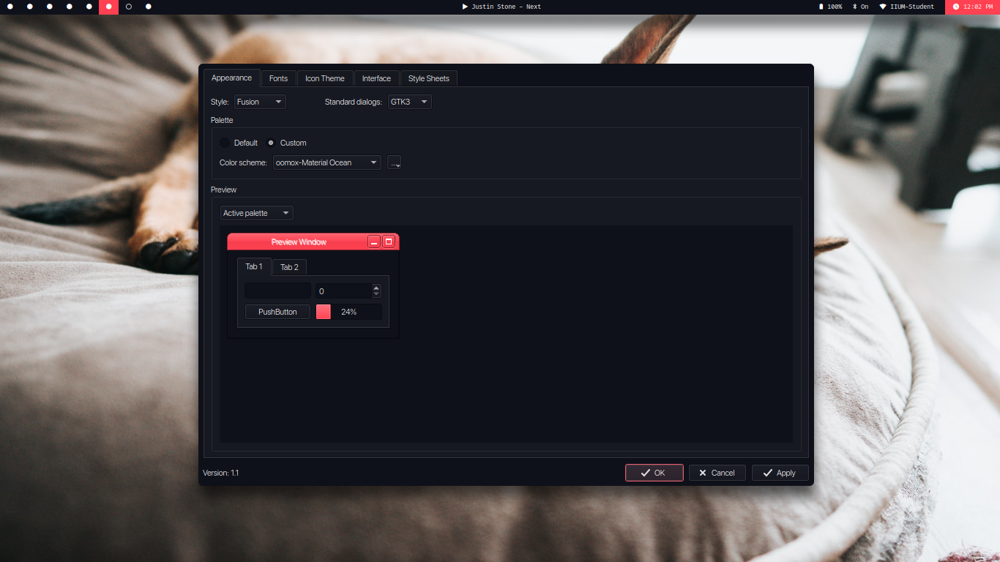

### Installation

- clone or download repo
- `cp Material-Ocean/colors/Material-Ocean.conf ~/.config/qt5ct/colors`
- `cp Material-Ocean/qss/material-ocean.qss ~/.config/qt5ct/qss`
- open Qt5ct.
- set theme to material ocean.
- enable material-ocean.qss style sheet.

### License

- Licensed under GNU's GPL3
  > see [LICENSE](./LICENSE) for more info
